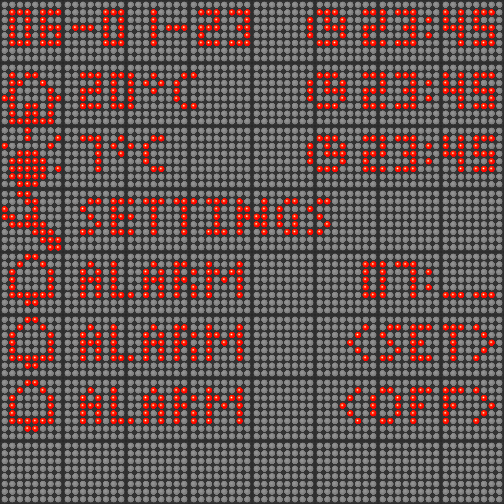

# ArduinoClockOS
Software for handling Arduino multi-device clock device.

**ATTENTION! Comments in the arduino code were written in Polish - changes soon.**

## Capabilities:

- Displaying Hour (all the time).
- Displaying Date (interchanges with other informations).
- Displaying Inside temperature.
- Displaying Outside temperature.
- Beeping every (24h, 12h, 6h, 3h, 1h, or can be disabled in menu).
- It contains menu that allow to set:
  - Time
  - Hour
  - Brightness
  - Beep frequency
  - Alarm
- Screen can change it brightness basing on the ambient brightness.
- Performing configuration from serial port (additional debug informations can be send).
- Performing configuration from bluetooth (no additional debug informations will be send).
- It recognizes from which device message came and where send response.
- Alarm
- Saving and reading configuration from SD card:
  - Alarm
  - Beeping every (24h, 12h, 6h, 3h, 1h, disabled).
  - Brightness

## In development:

- Showing message from bluetooth (from phone).
- Weather - that will be send via serial port and storred in SD card.

## Used components:

- Arduino Mega 2560
- Bluetooth module HC-06
- Buzzer 5V 12MM THT
- Dallas led matrix 8x 8x8 MAX7219
- Keypad 4x4 HX13B001
- 2x Photoresistor GL5528
- Real time clock DS3231
- SD Card module HW-125
- Temperature sensor DALLAS DS18B20

## Examples:

Overview photo showing from above:
- Default display mode (changes every 15 sec): Date & Time
- Default display mode (changes every 15 sec): In door temperature.
- Default display mode (changes every 15 sec): Outside temperature.
- Main menu, showing Settings menu elemnt to choose.
- Alarm settings, showing hour and minutes setting (highlihted minutes).
- Alarm settings, showing option to set alarm (entered hour and minutes and enables alarm).
- Alarm settings, showing option to disable alarm.

## Controls:

Navigation is done by:  
"D" - Enter settings mode, and back to default display mode from any place.  
"A" - Enter or set.  
"B" - Back.  
"*" - Navigate left in menu (change item, change option in settings or set other item to edit such as hour, minutes, etc...)  
"#" - Navigate right in menu (change item, change option in settings or set other item to edit such as hour, minutes, etc...)  
(Numeric data can be set by pressing numeric keys 0..9)  

# ArduinoConnect (WPF application)

Application that allow to control Arduino from PC using serial communication.

## Capabilities:

- Console Tab
  - Showing messages and debug messages that came from Arduino.
  - Sending messages and commands to arduino as pure text.

- Weather Tab
  - Getting weather from http://wttr.in/
  - Showing weather (raw data in TreeView and user friendly view in ListView).

- Settings Tab
  - Loading configuration from Arduino at once.
  - Setting Date & Time in Arduino.
  - Setting Alarm in Arduino.
  - Setting Brightness in Arduino.
  - Setting Hours beeping in Arduino.

## In development:

- Sending full configuration at once to Arduino.
- Sending weather to arduino (+ thread that will work in background and send weather every 3 days - app will work in Windows Tray)
